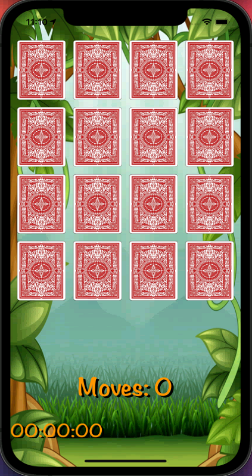

# MemoryGameApp
A memory game application that was built as part of an iOS application development course. 
The app includes a main screen, a game screen and a top ten screen.

## Gameplay

## Screenshots
### Home Screen

### Game Screen
   

### Top Ten Screen
 
